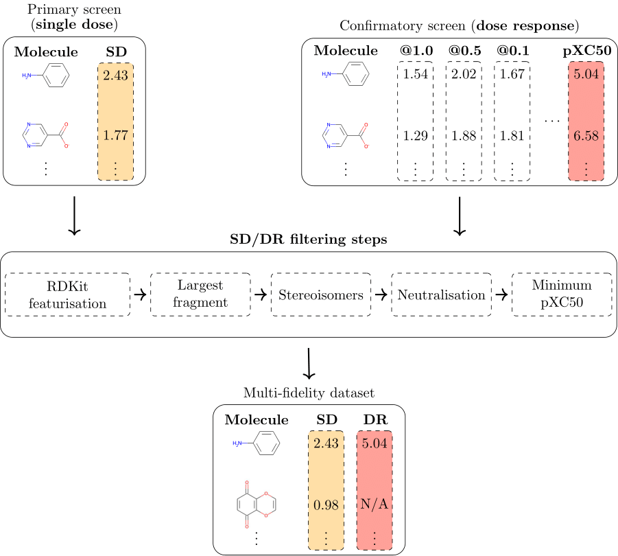

# MF-PCBA



## General
This repository contains the code accompanying the paper [MF-PCBA: Multi-fidelity high-throughput screening benchmarks for drug discovery and machine learning](https://chemrxiv.org/engage/chemrxiv/article-details/636fa49b80c9bfb4dc944c1c). It can be used to download, filter, and assemble the MF-PCBA datasets in a format that is easily usable for machine learning.

## Abstract
High-throughput screening (HTS), as one of the key techniques in drug discovery, is frequently used to identify promising drug candidates in a largely automated and cost-effective way. One of the necessary conditions for successful HTS campaigns is a large and diverse compound library, enabling hundreds of thousands of activity measurements per project. Such collections of data hold great promise for computational and experimental drug discovery efforts, especially when leveraged in combination with modern deep learning techniques, and potentially leading to improved drug activity predictions and cheaper and more effective experimental design. However, existing collections of machine learning ready public datasets do not exploit the multiple data modalities present in real-world HTS projects. Thus, the largest fraction of experimental measurements, corresponding to hundreds of thousands of 'noisy' activity values from primary screening, are effectively ignored in the majority of machine learning models of HTS data.

To address these limitations, we introduce MF-PCBA (Multi Fidelity PubChem BioAssay), a curated collection of 60 datasets that includes two data modalities for each dataset, corresponding to primary and confirmatory screening, an aspect that we call *multi-fidelity*. Multi-fidelity data accurately reflects real-world HTS conventions, and presents a new, challenging task for machine learning: the integration of low and high-fidelity measurements through molecular representation learning, taking into account the orders-of-magnitude difference in size between the primary and confirmatory screens. Here, we detail the steps taken to assemble MF-PCBA, in terms of data acquisition from PubChem and the filtering steps required to curate the raw data. We also provide an evaluation of a recent, deep-learning based method for multi-fidelity integration across the introduced datasets, demonstrating the benefit of leveraging all HTS modalities, and a discussion in terms of the roughness of the molecular activity landscape. In total, MF-PCBA contains over 16.6 million unique molecule-protein interactions.

## General
This repository contains the code required to download, filter, and assemble multi-fidelity datasets from PubChem.

The main functionality is provided in the script `pubchem_retrieve.py`. The script takes the following arguments:

-  `--AID`, this corresponds to the AID of the SD dataset on PubChem

-  `--list_of_sd_cols`, this corresponds to all of the columns that contain SD activity values (e.g. activity, inhibition, etc.). Should include columns for replicates

-  `--list_of_dr_cols`, this corresponds to all of the columns that contain DR activity values (e.g. activity, inhibition, etc.)

-  `--transform_dr`, this allows the conversion of DR values from XC50 to pXC50 (`transform_dr "pXC50"`), from a Log XC50 value to pIC50 (`transform_dr "minus"`), or no transformation (`transform_dr "no"`)

-  `--AID_DR`, optionally, if the DR dataset is reported in a different PubChem assay, this corresponds to the AID of the DR dataset

-  `--save_dir`, path to a directory where the resulting datasets will be stored; will be created if it does not exist


Example invocations:

1. SD and DR data are stored in a single PubChem assay:

```python pubchem_retrieve.py --AID "1445" --list_of_sd_cols "Primary Inhibition" "Primary Inhibition Rep 2" "Primary Inhibition Rep 3" --list_of_dr_cols "IC50" --transform_dr "pXC50" --save_dir retrieved```

2. SD and DR data are stored in separate PubChem assays:

```python pubchem_retrieve.py --AID "873" --list_of_sd_cols "Percent inhibition" --list_of_dr_cols "IC50 #1" --transform_dr "pXC50" --AID_DR "1431" --save_dir retrieved```

The notebook `add_default_pXC50.ipynb` can be used to add the default pXC50 values mentioned in the paper and other useful information for machine learning.

### Provided scripts to download the MF-PCBA datasets
Scripts to download, filter, and assemble all 60 multi-fidelity datasets (individually) are provided in the directory `retrieve-scripts` (make sure to update with a valid save directory).  The run time for a dataset with 335,445 SD molecules (AID 504329) is **554.52 seconds** (9 minutes and 15 seconds) on a high-end workstation with a fast internet connection. The scripts can easily be called in parallel, for example using SLURM with multiple nodes.

### Random seeds
The five random seeds for each of the 60 multi-fidelity datasets are provided in the file `MF_PCBA_random_seeds.json`, with an example of their usage in `split_DR_with_random_seeds.ipynb`.

### Requirements
The code requires the following Python libraries: `pandas`, `numpy`, `rdkit`, `tqdm`, `scipy`.

## Example workflow
1. Download one dataset or a selection of datasets. For example, the following command downloads the AID 1445 dataset to a `save_dir` directory:

```
python pubchem_retrieve.py --AID "1445"
--list_of_sd_cols "Primary Inhibition" "Primary Inhibition Rep 2" "Primary Inhibition Rep 3" 
--list_of_dr_cols "IC50" --transform_dr "pXC50" --save_dir <save_dir>
```

2. The step above downloaded and filtered the data corresponding to AID 1445. To obtain train, validation, and test sets, the `split_DR_with_random_seeds.ipynb` notebook can be used. The same 5 random split seeds as used in the paper are provided in the MF-PCBA repository and are used by default. After this step, the DR data is split into train, validation, and test sets 5 different times, with the resulting `.csv` files being saved in different directories:

```
parent_dir/
├── 0/
│   ├── train.csv
│   ├── validate.csv
│   └── test.csv
├── 1/
│   ├── train.csv
│   ├── validate.csv
│   └── test.csv
| ...
└──
...
```
## Multi-fidelity machine learning worflows
In-depth examples of how to use the MF-PCBA datasets are provided in the repository https://github.com/davidbuterez/multi-fidelity-gnns-for-drug-discovery, corresponding to the *Improving molecular property prediction with multi-fidelity graph representation learning on millions of experimental endpoints* paper.

## Citing
If you use the MF-PCBA datasets in your work, a citation to the accompanying paper is appreciated:

> ``` @article{buterez_janet_kiddle_liò_2022, place={Cambridge}, title={MF-PCBA: Multi-fidelity high-throughput screening benchmarks for drug discovery and machine learning}, DOI={10.26434/chemrxiv-2022-cb3tz}, journal={ChemRxiv}, publisher={Cambridge Open Engage}, author={Buterez, David and Janet, Jon Paul and Kiddle, Steven J. and Liò, Pietro}, year={2022}} This content is a preprint and has not been peer-reviewed.```
